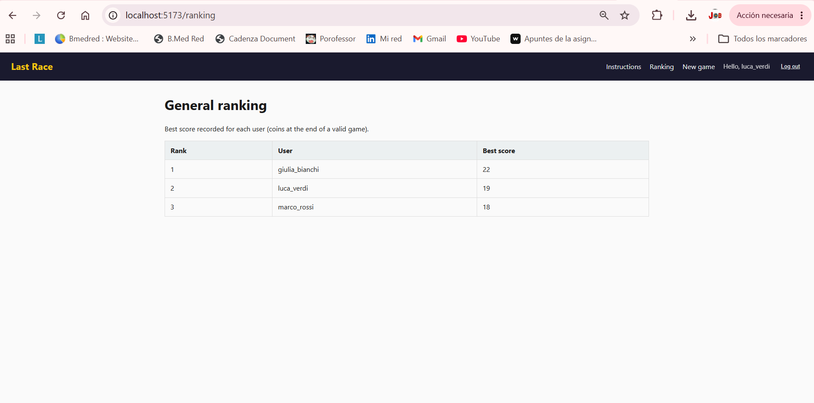
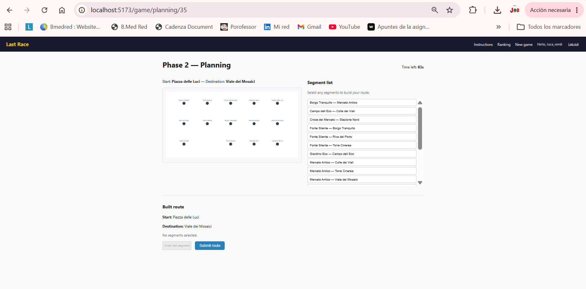

# Exam #1: "Last Race"
## Student: s350514 BAUTISTA JAVIER 

## React Client Application Routes

- Route `/`: Public instructions for anonymous visitors (no network map). Explains game rules and phases.
- Route `/login`: Login form for registered users (Passport session).
- Route `/ranking`: General ranking table (best score per user, public).
- Route `/game/setup`: Phase 1 — full network map with lines; creates a new game (authenticated).
- Route `/game/planning/:gameId`: Phase 2 — stations without lines, segment list, 90s timer, route building (authenticated).
- Route `/game/execution/:gameId`: Phase 3 — shows one journey step and random event at a time (authenticated).
- Route `/game/result/:gameId`: Phase 4 — final score and links to play again (authenticated).

## API Server

### Session / Authentication

- `POST /api/sessions/login`
  - Request body: `{ "username": "string", "password": "string" }`
  - Response *(200)*: `{ "id": 1, "username": "marco_rossi", "bestScore": 18 }` — sets session cookie
  - Response *(401)*: `{ "error": "Invalid credentials" }`

- `POST /api/sessions/logout`
  - Request body: none
  - Response *(200)*: `{ "ok": true }` — destroys session and clears cookie

- `GET /api/sessions/current`
  - Request parameters: none
  - Response *(200)*: `{ "id": 1, "username": "marco_rossi", "bestScore": 18 }`
  - Response *(401)*: `{ "error": "Not authenticated" }`

### Network *(all authenticated)*

- `GET /api/network/full`
  - Request parameters: none
  - Response *(200)*:
    ```json
    {
      "stations": [{ "id": 1, "name": "Nexus Centrale", "x": 120, "y": 80, "isInterchange": 1 }],
      "lines": [{ "id": 1, "name": "Red Line", "color": "#c0392b" }],
      "lineStations": [{ "lineId": 1, "stationId": 1, "position": 0 }],
      "segments": [{ "id": 1, "stationAId": 1, "stationBId": 2 }]
    }
    ```

- `GET /api/network/planning`
  - Request parameters: none
  - Response *(200)*: stations and segments only — no line information (by design, for the planning phase)
    ```json
    {
      "stations": [{ "id": 1, "name": "Nexus Centrale", "x": 120, "y": 80 }],
      "segments": [{ "id": 1, "stationAId": 1, "stationBId": 2, "stationAName": "Nexus Centrale", "stationBName": "Porta Aurora" }]
    }
    ```

### Ranking

- `GET /api/ranking`
  - Request parameters: none
  - Response *(200)*:
    ```json
    {
      "ranking": [
        { "username": "giulia_bianchi", "bestScore": 22 },
        { "username": "marco_rossi", "bestScore": 18 }
      ]
    }
    ```

### Games *(all authenticated)*

- `POST /api/games`
  - Request body: none — server picks start/end stations randomly (min. 3 segments apart via BFS)
  - Response *(201)*:
    ```json
    {
      "id": 5,
      "phase": "setup",
      "coins": 20,
      "score": null,
      "isValidRoute": false,
      "startStation": { "id": 1, "name": "Nexus Centrale" },
      "endStation": { "id": 12, "name": "Campo dell Eco" },
      "route": [],
      "executionIndex": 0
    }
    ```

- `GET /api/games/:id`
  - Request parameters: `id` — game id (must belong to the authenticated user)
  - Response *(200)*: same game object as above with current state
  - Response *(404)*: `{ "error": "Game not found" }`

- `POST /api/games/:id/advance`
  - Request parameters: `id`
  - Request body: `{ "phase": "planning" }` — only setup → planning transition is used by the client
  - Response *(200)*: updated game object
  - Response *(400)*: `{ "error": "Cannot advance to planning from current phase" }`

- `PUT /api/games/:id/route`
  - Request parameters: `id`
  - Request body:
    ```json
    {
      "route": [
        { "fromId": 1, "toId": 2 },
        { "fromId": 2, "toId": 6 },
        { "fromId": 6, "toId": 10 }
      ]
    }
    ```
  - Response *(200)* — valid route:
    ```json
    {
      "id": 5, "phase": "execution", "coins": 19, "score": 19, "isValidRoute": true,
      "startStation": { "id": 1, "name": "Nexus Centrale" },
      "endStation": { "id": 12, "name": "Campo dell Eco" },
      "route": [{ "fromId": 1, "toId": 2 }],
      "executionIndex": 0,
      "validation": { "valid": true },
      "totalSteps": 3
    }
    ```
  - Response *(200)* — invalid route: same object with `"coins": 0, "score": 0, "isValidRoute": false` and `"validation": { "valid": false, "reason": "Line change at non-interchange station" }`

- `GET /api/games/:id/execution-step`
  - Request parameters: `id`
  - Response *(200)* — step in progress:
    ```json
    {
      "done": false,
      "stepIndex": 0,
      "totalSteps": 3,
      "step": {
        "fromStation": { "id": 1, "name": "Nexus Centrale" },
        "toStation": { "id": 2, "name": "Porta Aurora" },
        "event": { "id": 3, "description": "Kind passenger, small tip", "effect": 1 }
      },
      "coins": 21
    }
    ```
  - Response *(200)* — all steps done: `{ "done": true, "invalidRoute": false, "coins": 19, "score": 19 }`
  - Response *(200)* — invalid route: `{ "done": true, "invalidRoute": true, "coins": 0, "score": 0, "message": "Invalid or incomplete route: you lose all your coins." }`

- `POST /api/games/:id/execution-next`
  - Request parameters: `id`
  - Request body: none
  - Response *(200)* — more steps remaining: `{ "done": false, "executionIndex": 1 }`
  - Response *(200)* — last step reached: `{ "done": true, "phase": "result", "score": 19, "coins": 19 }`

## Database Tables

- Table `users` — registered players, salted password hash, `best_score` for ranking.
- Table `lines` — metro line name and display color.
- Table `stations` — station name, map coordinates, interchange flag.
- Table `line_stations` — ordered stations per line.
- Table `segments` — undirected adjacent station pairs (for planning list).
- Table `events` — random event description and coin effect (-4..+4).
- Table `games` — per-play state: stations, phase, route, coins, score, execution steps JSON.

## Main React Components

- `Layout` (in `components/Layout.jsx`): header navigation and outlet for pages.
- `ProtectedRoute` (in `components/ProtectedRoute.jsx`): redirects unauthenticated users to login.
- `NetworkMap` (in `components/NetworkMap.jsx`): SVG map; optional metro lines.
- `SegmentList` (in `components/SegmentList.jsx`): selectable list of network segments.
- `RouteSummary` (in `components/RouteSummary.jsx`): shows built route during planning.
- `AuthProvider` (in `contexts/AuthContext.jsx`): session state and login/logout.

## Screenshot






## Users Credentials

- marco_rossi, password123
- giulia_bianchi, metro2026
- luca_verdi, rails99

## Use of AI Tools

AI assistance (Cursor with Claude) was used during the development of this project, mainly for code scaffolding, suggesting Express route structure, and generating the initial SQLite schema. It was also used to draft parts of the CSS layout and to help debug specific React issues (e.g. the timer logic in PlanningPage and the Passport session setup).All generated code was reviewed and tested manually and adapted where neccesary

